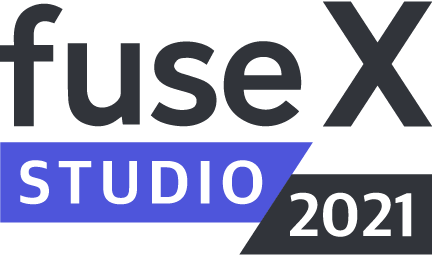

> **Fuse Studio** is a visual desktop tool suite for working with the [**Fuse Open**](https://fuseopen.com/) framework, on **macOS** and **Windows**.

## Download

Please see [our releases](https://github.com/fuse-x/studio/releases) for available downloads.

## Issues

Please report issues [here](https://github.com/fuse-x/studio/issues).
